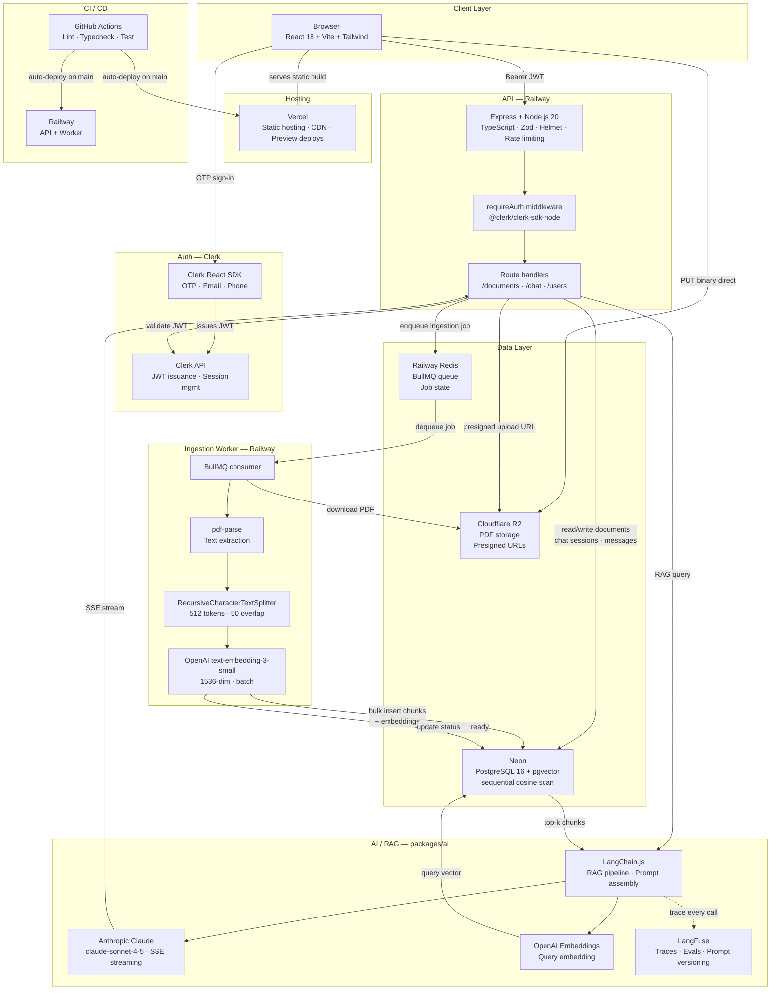

# HomeVault — Architecture Diagram

## System Architecture



---

## Data Flow Narratives

### Upload & Ingestion

```
User selects PDF + enters name
  → POST /api/v1/documents/upload-url         (API creates DB record, returns presigned URL)
  → PUT <presigned-url> binary                (browser uploads direct to R2, bypasses API)
  → POST /api/v1/documents/:id/confirm        (API enqueues BullMQ job, status → processing)
  → BullMQ worker picks up job
      → downloads PDF from R2
      → extracts text via pdf-parse
      → splits into 512-token chunks (50 overlap)
      → batch-embeds via OpenAI text-embedding-3-small
      → bulk inserts DocumentChunks + embeddings into Neon (pgvector)
      → updates document status → ready
  → client refreshes manually (interim) or receives SSE push event (planned — see features/document-status-sse.md)
```

### RAG Chat Query

```
User submits question
  → POST /api/v1/chat/sessions/:id/messages
  → packages/ai: embed query via OpenAI
  → pgvector cosine search across user's DocumentChunks
      WHERE user_id = ? AND similarity >= 0.75
      ORDER BY embedding <=> $queryVector LIMIT 5
  → assemble grounded prompt (system + top-k chunks + session history)
  → stream Claude response via SSE
  → parse inline citations from streamed text
  → persist assistant message + citations to Neon
  → log full trace to LangFuse (latency · tokens · chunks · scores)
  → SSE events arrive at browser token-by-token
  → citations rendered as chips below message
```

---

## Service Responsibilities

| Service | Responsibility | Cost tier |
|---|---|---|
| **Vercel** | Serve static React build; CDN; preview deployments per PR | Free |
| **Railway (API)** | Express app; auth middleware; document + chat routes; rate limiting | Free / $5 USD Hobby |
| **Railway (Worker)** | BullMQ consumer; PDF extraction; chunking; embedding; pgvector writes | Free / included |
| **Clerk** | OTP issuance (email + phone); JWT signing; session management | Free (10k MAU) |
| **Neon** | PostgreSQL 16 + pgvector; stores all relational data + vector embeddings | Free (0.5 GB) |
| **Cloudflare R2** | PDF blob storage; presigned upload + download URLs; no egress fees | Free (10 GB) |
| **Railway Redis** | BullMQ job queue backing store; job state + retry tracking | Included with Railway |
| **Anthropic Claude** | LLM completions; streamed grounded answers; citation generation | ~$3–5 USD/mo |
| **OpenAI** | `text-embedding-3-small`; query + ingestion embeddings | ~$1 USD/mo |
| **LangFuse** | LLM trace logging; prompt versioning; RAG eval datasets | Free (50k obs/mo) |
| **GitHub Actions** | CI on every push; lint + typecheck + unit + integration tests | Free |

---

## Key Design Decisions

**Documents are the primary entity.** There are no folders, spaces, items, or hierarchies. A user uploads a PDF and names it. All documents are owned directly by the user and the RAG pipeline always searches across the full library.

**Direct-to-R2 upload.** The browser PUTs the file binary directly to Cloudflare R2 using a presigned URL. The API never proxies file bytes — this keeps the API process lean and avoids Railway bandwidth limits.

**BullMQ over SQS.** Ingestion is async and retriable without AWS. BullMQ backed by Railway Redis provides job queuing, retries with exponential backoff, dead-letter visibility, and an optional dashboard — all within the same Railway project.

**pgvector over a dedicated vector DB.** Keeping embeddings in Neon alongside relational data means a single database connection, transactional consistency between document status and chunks, and no additional service to operate. At current scale a sequential scan is used; an ivfflat index can be added in a later migration if chunk count grows into the tens of thousands.

**SSE over WebSockets for chat streaming.** Server-sent events are unidirectional, HTTP/1.1 compatible, and trivial to implement in Express. SSE will also be used for document processing status updates (see features/document-status-sse.md) — no WebSockets are needed anywhere in the stack.

**Clerk for passwordless OTP.** Supports email code and SMS code out of the box via dashboard toggle. Backend JWT validation is a single middleware line — swappable for Cognito with no application logic changes if migrating to AWS.
```

---

## Document Status SSE (Planned)

> Current state: the Documents page has a manual refresh button. Polling was removed to avoid unnecessary API load.
> Planned: replace with server-pushed status updates via SSE. See `features/document-status-sse.md` for the full design.

At a high level, the worker will emit events through a singleton `SseManager` after each BullMQ job completes or fails. A new `GET /api/v1/documents/status-stream` endpoint holds the connection open per authenticated user and writes those events as they arrive. The client opens this stream once on mount, listens for `document:ready` / `document:failed` events, and calls `queryClient.invalidateQueries(['documents'])` — a single targeted refetch with zero polling.

```
BullMQ job completes / fails
  → worker calls sseManager.emit(userId, 'document:ready' | 'document:failed', { documentId })
  → GET /api/v1/documents/status-stream writes event to all open Response objects for that user
  → browser EventSource receives event
  → queryClient.invalidateQueries(['documents']) → one refetch, UI updates
```

---

## AWS Migration Path

When migrating to a full AWS CDK stack, each service maps directly to an AWS equivalent with minimal application code changes:

| Current | AWS equivalent | Change required |
|---|---|---|
| Neon | RDS PostgreSQL 16 | `DATABASE_URL` env var only |
| Cloudflare R2 | S3 | Remove custom endpoint from S3 client |
| Clerk | Cognito (PKCE) | Swap auth middleware; update `clerk_user_id` → `cognito_sub` column |
| Railway Redis + BullMQ | SQS + ECS worker | Rewrite worker consumer entrypoint only; job handler unchanged |
| Railway (API) | ECS Fargate + ALB | Same Docker image, new deployment target |
| Vercel | CloudFront + S3 | `npm run build` output → S3 bucket |
| Railway env vars | Secrets Manager | CDK injects at task definition time |
| GitHub Actions (CI only) | GitHub Actions (CI + CDK deploy) | Add `cdk deploy` step |
